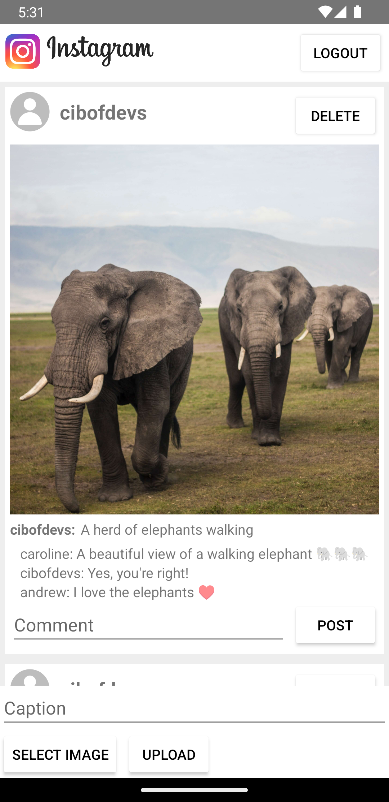

## ABOUT

 An Instagram Clone Apps Built with Kotlin
          
## HOW TO
1. Backend Configuration
   - <a href="https://github.com/cibofdevs/instagam-clone-api">Clone Backend API</a>
   - Install Dependencies:
     ```bash
     pip install -r requirements.txt
     ```
   - Run API:
     ```bash
      uvicorn main:app --reload
      ```   
2. Run Apps
   <br /> 
